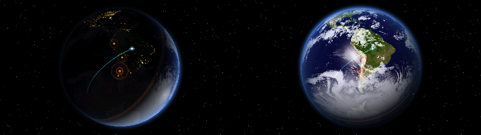
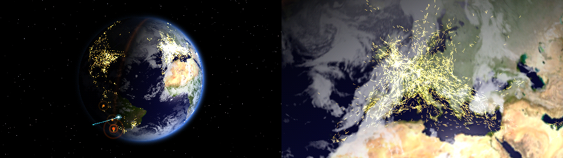
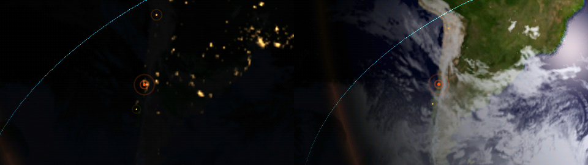

# TIERRA VIVA: prueba de potencia del hardware del ESP32-P4

**Español** · [English](#english)

**Una prueba de esfuerzo real del ESP32-P4:** los dos núcleos al 86-96 %, el PPA, el DMA, el JPEG y el cifrado por hardware trabajando **al mismo tiempo**, mientras dibuja la Tierra en vivo, sin GPU. Sirve para saber de qué es capaz este chip de US$15 antes de diseñar con él: cada número de abajo está medido en la placa.

    

La Tierra en vivo en una pantalla táctil de 2,8", dibujada entera por un ESP32-P4 sin GPU:

- la luz del sol de este instante;
- las nubes reales de satélite;
- los sismos de las últimas 24 h;
- la Estación Espacial Internacional con su estela;
- los ~6.500 aviones que están volando ahora mismo.

Se gira con el dedo y tiene zoom. La segunda escena es **BIOMA**: una colonia de 200.000 agentes Physarum que evoluciona sola y persigue el dedo.

**Estado: funcional y probado en el hardware (28-sep-2026).**





*(Las imágenes salen del mismo `tierra.c` que corre en el P4, compilado en el PC con `tierra/host_test`.)*

## Qué hace

| | |
|---|---|
| **Globo 3D** | Día con relieve (NASA Blue Marble) y noche con las luces de las ciudades (NASA Black Marble 2012). Franja de crepúsculo, sol reflejado en el mar, atmósfera en el borde y estrellas que titilan. El sol se calcula con la declinación y la ecuación del tiempo. |
| **Nubes reales** | Imagen de satélite (datos de EUMETSAT) que se renueva cada 3 h. El **decodificador JPEG por hardware** del P4 la decodifica en 11 ms. |
| **Sismos** | M2.5+ de las últimas 24 h (USGS), cada 10 min. Laten según la magnitud; al tocar uno se ven su magnitud y su lugar. |
| **EEI** | Posición cada 5 s (wheretheiss.at), con su estela de la última media hora. |
| **Aviones** | Todos los que están en vuelo en el mundo (OpenSky, ~6.500, ~1 MB por descarga). Cada avión sigue volando con su rumbo y velocidad reales entre descargas; con zoom se ve su rayita de rumbo. |
| **Dedo** | Arrastrar gira el globo, con inercia. La barra del borde derecho da zoom hasta ×6 (suave y con filtrado bilineal). La esquina de abajo a la izquierda cambia a BIOMA. |
| **Hora** | Sale de la cabecera `Date` de las mismas respuestas HTTPS. |

## Cuánto del P4 usa (medido)

| Recurso | Uso |
|---|---|
| **CPU** (2 núcleos RISC-V a 360 MHz) | **90-96 % / 86-89 %**. El globo se reparte por mitades entre los dos núcleos. |
| **Globo** | **21-24 cuadros/s** a tamaño normal y ~10 con zoom máximo (hay más píxeles de globo que dibujar). |
| **Pantalla** | **31,7 cuadros/s**: el techo físico del bus SPI a 40 MHz (153.600 bytes en 31,0 ms; el mínimo teórico es 30,7). |
| **PPA** | Recorta la imagen para la pantalla (SRM). Dibuja los cuadros intermedios entre dos cuadros del globo mezclándolos (blend). Voltea los bytes al orden que pide la pantalla: con alfa 0 y `byte_swap` en la entrada, verificado idéntico a la CPU en los 65.536 colores al arrancar. |
| **DMA** | El SPI lee cada cuadro directo desde la PSRAM (`psram_dma_direct`): la CPU no toca ni un píxel de la pantalla. |
| **JPEG por hardware** | Decodifica las nubes. Codifica el video 1080p de la webcam UVC y de la página, pero sólo cuando alguien lo mira. |
| **Cifrado por hardware** | AES, SHA y ECC para el HTTPS (mbedTLS; la negociación TLS toma ~3 s). |
| **PSRAM** | ~17 MB en uso: texturas (2 MB, las 4 en un téxel de 32 bits), tabla por píxel del globo (620 KB), aviones y cuadros. |

Mejoras medidas en el camino:

| Paso | Globo |
|---|---|
| Primera versión | 12 cuadros/s |
| Doble búfer (dibujar mientras el PPA escala el anterior) | 18 |
| Apagar la cadena 1080p cuando nadie mira | 21 |
| Tabla por píxel (mientras el globo sólo gira de lado, cada cuadro sólo suma el giro) | 23 |

## Hardware

- **ESP32-P4** WT9932P4-TINY (chip v1.0). ESP-IDF v6.1.
- **Pantalla** táctil 2,8" SPI ILI9341 + XPT2046, enchufada directo en la protoboard. Sus 14 pines caen en los 14 primeros pines del header derecho del P4, sin cables:

  | pantalla | VCC | GND | CS | RESET | DC | SDI | SCK | LED | SDO | T_CLK | T_CS | T_DIN | T_DO | T_IRQ |
  |---|---|---|---|---|---|---|---|---|---|---|---|---|---|---|
  | P4 | IO15 | IO14 | IO13 | IO12 | IO11 | IO10 | IO9 | IO6 | IO5 | IO4 | IO3 | IO2 | IO54 | IO53 |

  IO15 e IO14 fabrican la alimentación (alto y bajo fijos, fuerza máxima). La luz de fondo va por PWM.
- **Internet:**
  - por el cable USB (puerto HUSB), con `tierra/puente_internet.py` corriendo en el PC;
  - o por Wi-Fi, con un ESP32-C3 montado encima como esclavo ESP-Hosted por UART (`c3-wifi/slave`).

## Compilar y cargar

```
cd tv-fw
idf.py build
python -m esptool --chip esp32p4 -p COMx -b 921600 write-flash 0x20000 build/bioma_p4.bin
```

Internet por el cable USB: en el PC, `python tierra/puente_internet.py`.
- El PC deja conexiones esperando en el puerto 5001 del P4. El P4 pide `CONNECT host:443` y hace él mismo el HTTPS; el PC sólo ve bytes cifrados.
- Todas las conexiones las abre el PC, así que Windows no pide firewall ni administrador.

## Estructura

- `tv-fw/main/tierra.c`: el dibujo del globo, en C puro. Se prueba en el PC con `tierra/host_test/prueba.c`, que saca una imagen `.ppm`; `tabla.c` verifica que la tabla por píxel da la misma imagen.
- `tv-fw/main/tierra_app.c`: datos vivos, dedo, zoom y textos.
- `tv-fw/main/red.c`: HTTPS por el túnel del cable o por Wi-Fi.
- `tv-fw/main/lcd.c`: el motor de la pantalla (PPA + DMA desde PSRAM, calibración del táctil en la NVS).
- `tv-fw/main/bioma*.c`: la colonia Physarum y su evolución (la juzga el tamaño de un JPEG).
- `tierra/convertir_texturas.py` y `tierra/gen_letra.py`: texturas de la NASA y la letra del HUD.

## Fuentes de datos y créditos

- Texturas: NASA Visible Earth, Blue Marble y Black Marble 2012 (dominio público).
- Nubes: [clouds.matteason.co.uk](https://clouds.matteason.co.uk), con datos de EUMETSAT (libres de uso).
- Sismos: USGS Earthquake Hazards Program.
- EEI: [wheretheiss.at](https://wheretheiss.at).
- Aviones: [The OpenSky Network](https://opensky-network.org). Sin cuenta permite ~100 consultas al día, por eso las posiciones se renuevan cada 15 min.
- ESP-Hosted (Espressif, Apache-2.0), incluido con un parche de resincronización del UART.

## English

**TIERRA VIVA is a real-world stress test of the ESP32-P4.** Both RISC-V cores run at 86–96 %, and the PPA, DMA, hardware JPEG and hardware crypto all work **at the same time**. Meanwhile, with no GPU, the P4 renders a live Earth on a 2.8" touchscreen:

- real sunlight;
- satellite clouds;
- the last 24 h of earthquakes;
- the ISS;
- ~6,500 aircraft in flight.

Measured on the board:

| | |
|---|---|
| Globe | 21–24 fps |
| Display | 31.7 fps, the physical limit of 40 MHz SPI |
| Cloud image decode (hardware JPEG) | 11 ms |
| Display path | the SPI DMA reads each frame straight from PSRAM, so the CPU never touches a display pixel |
| PSRAM in use | ~17 MB |
| HTTPS | done by the P4 itself with its crypto accelerators, through a USB tunnel or over Wi-Fi from an ESP32-C3 mounted on top (ESP-Hosted over UART) |

The second scene, **BIOMA**, is a 200,000-agent Physarum colony that chases your finger. The tables above (in Spanish) list what each hardware block does, plus every optimization measured along the way: 12 → 18 → 21 → 23 fps.

## Autor
Desarrollado por **Francisco Aldunate** — firmware para ESP32 (P4, S3 y C3) en C con ESP-IDF, el framework oficial de Espressif.
Portafolio: [franciscoaldunate.cl](https://franciscoaldunate.cl) · GitHub: [@franciscoaldun](https://github.com/franciscoaldun)
